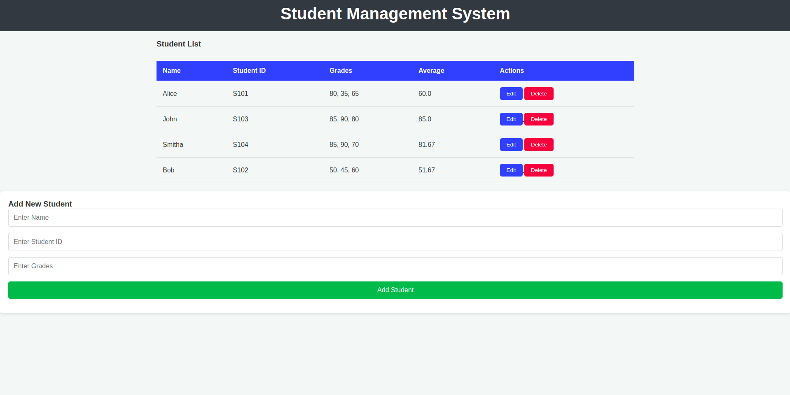

# Student Management System 📚👩‍🎓👨‍🎓

A simple **Student Management System** built with **Flask** and **SQLite**. This app allows you to:
- 📥 Add students
- 📋 View student details
- ✏️ Edit student information
- ❌ Delete students
- 📊 Calculate and display average grades

## Features ✨
- 🌍 **Responsive and beautiful UI**
- 🧑‍💻 **Easy to use** and manage student records
- 🗄️ **SQLite** database for data persistence
- 🔄 **Add/Edit/Delete** student operations

## 📸 Screenshots  
### 🔍 Example   
  

## Installation ⚙️

1. Clone the repository:
   ```bash
   git clone https://github.com/yourusername/student-management-system.git
    ```
2. Navigate to the Project directory:
   ```bash
   cd student-management-system
   ```
3. Install requried packages:
   ```bash
   pip install -r requirements.txt
    ```
4. Run the app:
   ```bash
   python app.py
   
## License 📝
This project is licensed under the MIT License - see the LICENSE file for details.

Made with ❤️ by Darpan YB
